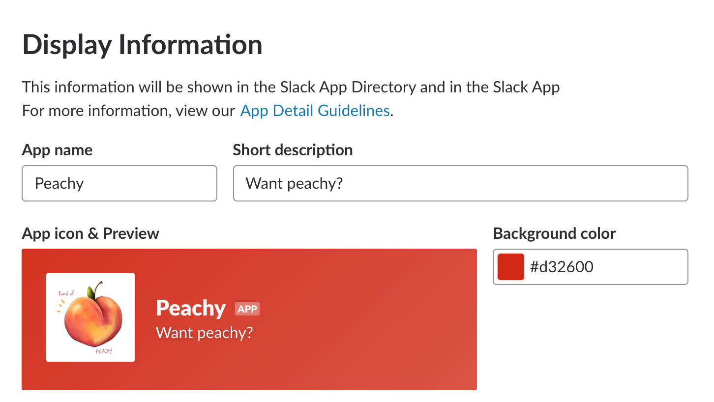
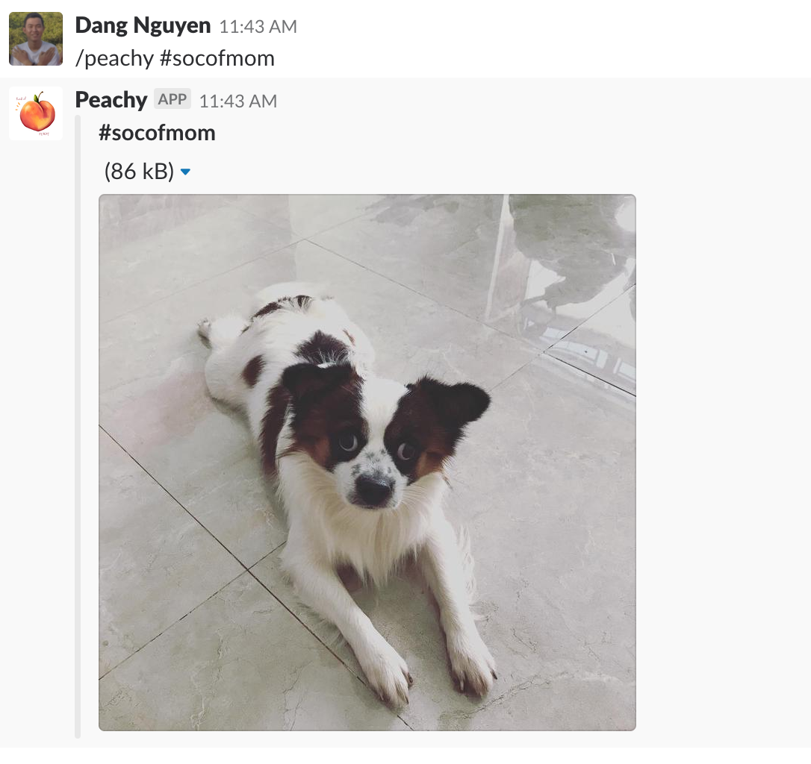
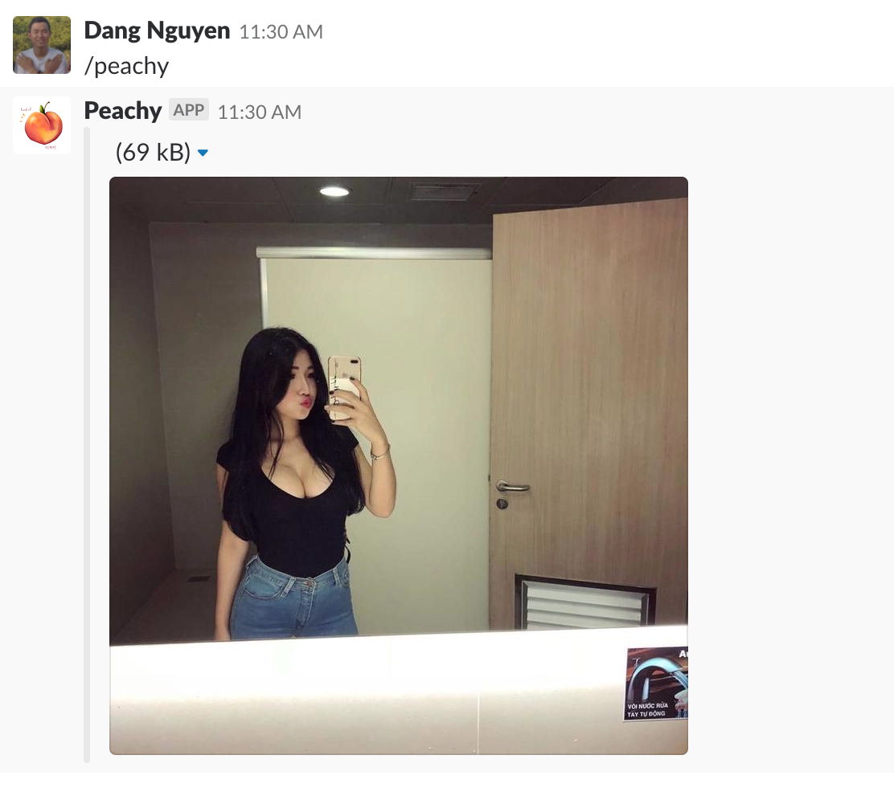

# peachy-slack-bot

Tag and profile are supported

## How to use
* `/peachy`: get a random "peachy" image
* `/peachy #tag`: get a image by #tag
* `/peachy @profile`: get a image by @profile

### Configuration
* `LIMITED_CHANNELS`(`up.json`): list of channels this bot can post to, not work well with private groups
    - Example:  `"LIMITED_CHANNELS": "directmessage, privategroup, general"`
        - `privategroup` == all private groups
        - `general` == #general
        - `directmessage` == all direct message

## Deployment

Using [apex/up](https://github.com/apex/up)
* Run `up`
* Get the endpoint url by `up url`
* Setup slack application

## Result

