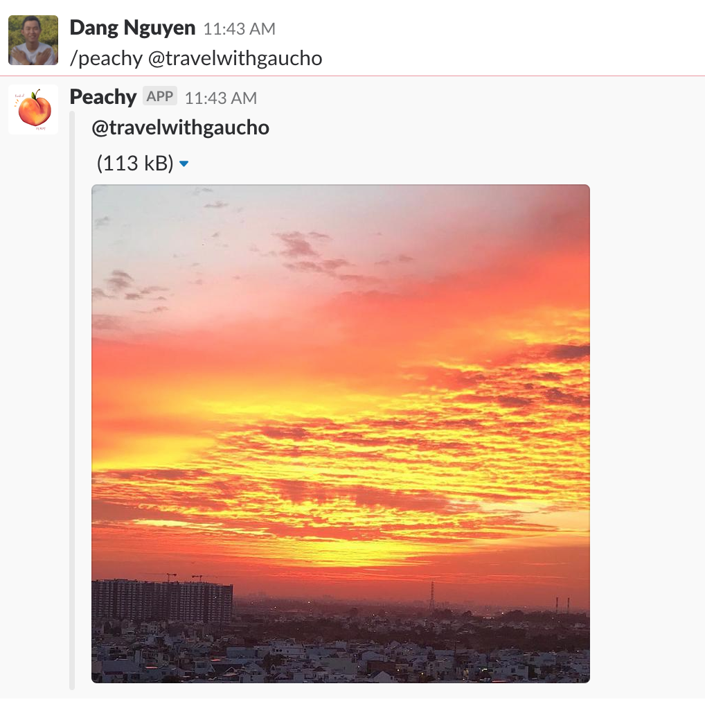

# peachy-slack-bot

A slack app to get "peachy" image from instagram :smile:

Tag and profile are supported

## Deployment

Using [apex/up](https://github.com/apex/up)
* Run `up`
* Get the endpoint url by `up url`
* Setup slack application

## Result

