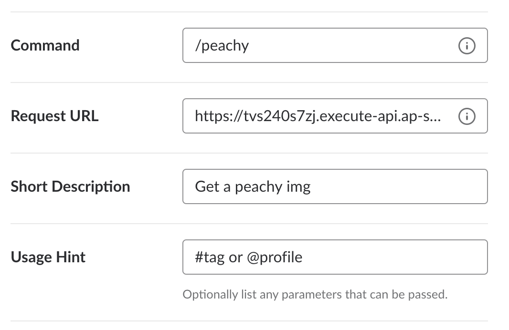

# peachy-slack-bot

A slack app to get "peachy" image from instagram :girl: :peach:

Tag and profile are supported

## How to use
* `/peachy` : get a random image
* `/peachy #tag`: get a image by #tag
* `/peachy @profile`: get a image by @profile

### Configuration
* `LIMITED_CHANNELS`(`up.json`): list of channels this bot can post to, not work well with private groups
    - Example:  `"LIMITED_CHANNELS": "privategroup, general"`
        - `privategroup` == all private groups
        - `general` == #general

## Deployment

Using [apex/up](https://github.com/apex/up)
* Run `up`
* Get the endpoint url by `up url`
* Setup slack application

## Result

